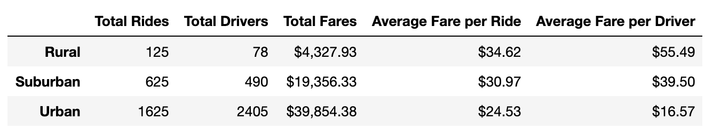
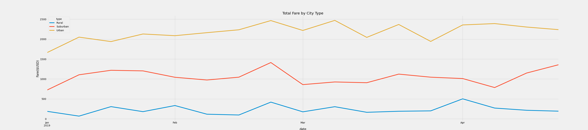

# PyBer_Analysis

## Overview of the Analysis
We were tasked with creating a summary of the ride sharing data. We seperated the summarized the data by different cuty types - Urban, Suburban, Rural. We utilized line, bubble, scatter, pie and box-and-whisker plots to help visualize the data. The purpose of this analysis was to perform some staistical analysis on the data and determine the mean, median and mode of different data sets.

## Results 
* As expected when there are more drivers we expect the average fare per driver to be low.
* Rural areas had less drivers as we would expect in that sort of community compared to more urban area and city like communites.
* Fares for the rural, urban and suburban commuites start at $200, $1,700 and $750 respectively. 
* We notice lots of fluctuations in the urban fare prices, which make sense as there are more drivers we expect the market to be a little volatile and price more dependent on the consumer.

## Summary 
* I encourage PyBer to expand their invest more drivers in the rural and suburban communities as there is still more market opportunities. It is unwise to have so much investement in one place. A possible competitor could take over at any time.
* They should take inspiration from the prices of the urban comunities. It appears people can pay more for their services. So it may be time to increase their prices.
* I recoomend PyBer to expand more in the rural communities and aim for at least 100 drivers in the rural communities. use of special discounts based on a city type might bring more business into PyBer.

